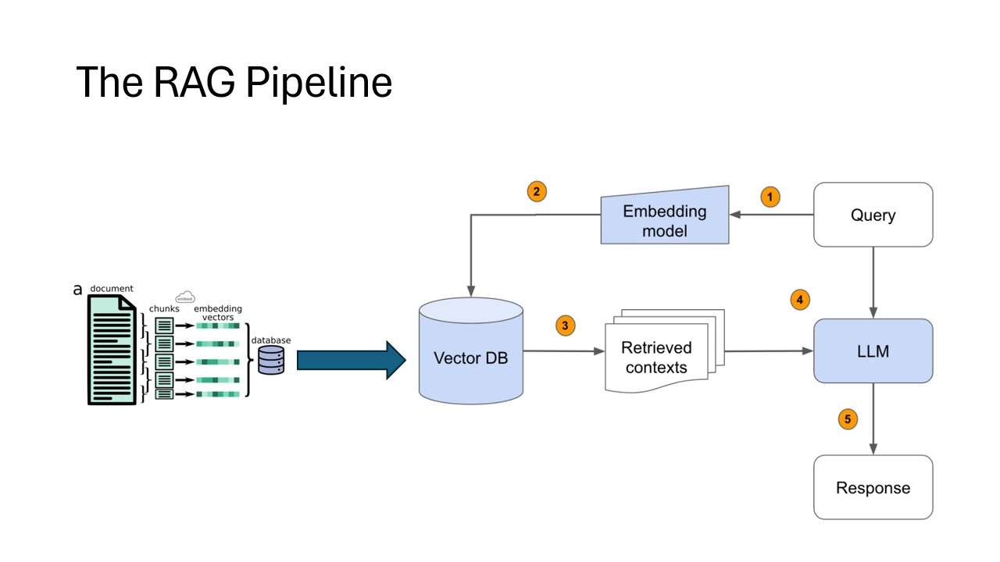

RAG (Retrieval Augmented Generation)

RAG solves a key limitation of LLMs: they have knowledge cutoffs and can "hallucinate" information. Instead of relying only on the model's trained knowledge, RAG retrieves relevant information from external sources and includes it in the context.

User Query → Retrieve Relevant Documents → Augment Prompt → Generate Answer

1. User Query
    You ask a question

2. Retrieval Phase
    Search through a knowledge base (documents, database, web)
    Find the most relevant information
    Return top-k most similar documents

3. Augmentation Phase
    Combine the retrieved documents with your original query
    Create an enhanced prompt that includes both the question and the relevant context

4. Generation Phase
    The LLM generates an answer using both its training knowledge AND the retrieved information
    Result: More accurate, factual, and up-to-date responses

Retriever
    Vector Database: Stores document embeddings for fast similarity search
    Embedding Model: Converts text into vectors (numbers) that capture meaning
    Similarity Search: Finds documents most similar to the query

Generator
    LLM: Any large language model (GPT, LLaMA, etc.)
    Prompt Engineering: Carefully crafted prompts that include retrieved context

