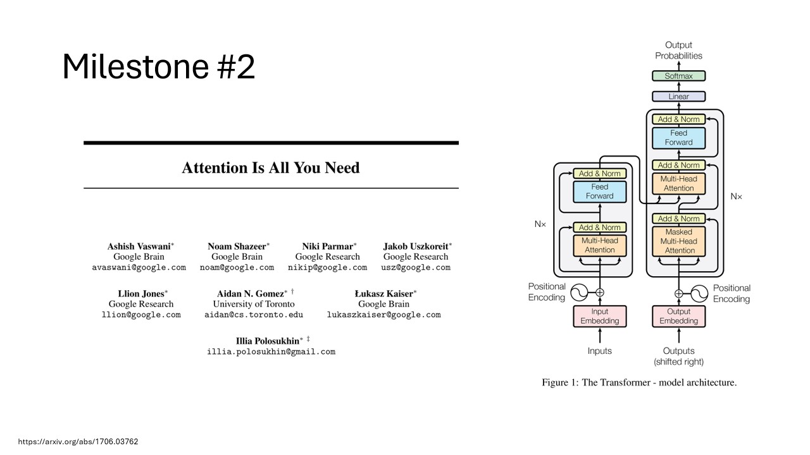
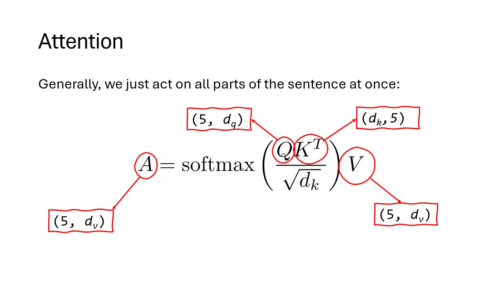

Attention is a mechanism that lets a model focus on the most relevant parts of the input when producing an output.


# Attention
- Paper-- Attention is all you need 

<!-- docs/fundamentals/NIPS-2017-attention-is-all-you-need-Paper.pdf -->
This is the paper that created Transformers (GPT, ChatGPT, etc.)



## Why it matters
It helps the model capture relationships between words or tokens, even when they are far apart.

## Simple intuition
Instead of treating every word equally, the model gives more weight to the most useful ones.

## Example
In the sentence “The animal didn’t cross the street because it was tired,” attention helps the model connect “it” to “animal.”
## The Attention Equation
The core attention mechanism uses this formula:

```
Attention(Q, K, V) = softmax( (Q * K^T) / sqrt(d_k) ) * V
```

Breaking it down step by step:

- **Q, K, V** are matrices from the input sequence.
- **Q** (Query) represents what we're looking for.
- **K** (Key) represents what each part of the input offers.
- **V** (Value) contains the actual information to retrieve. 'How do I modify the original concept, to get to the new concept?'

- **QK^T** computes similarity scores between queries and keys.
- **Divide by sqrt(d_k)** scales the scores to prevent large values.
- **Softmax** converts scores to probabilities (weights) that sum to 1.
- **Multiply by V** weights the values by their relevance scores.
- **Result** is a weighted sum of values, focusing on important parts.

This allows the model to attend to relevant information dynamically.


## Related concepts
- Transformer
- Self-attention
- Token